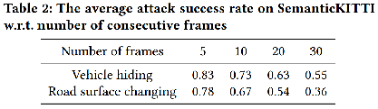
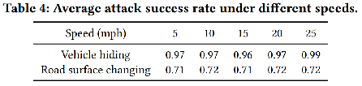

Deep-learning models like Convolutional Neural Networks (CNN) and Graph Convolutional Network(GCN) are often used in 3D point cloud processing. Some existing work tend to explore the robustness of 3D PCSS models by generating and using adversarial attack. While in the real world autonomous driving scene, a set of sensors may be using to help detect the driving environment. As for security analysis, we assume the attacker has white-box access to the driving related sensor  messages, include 2D images and 3D point clouds usually used in objective recognition and semantic segmentation which is very useful for self-driving decision. In this paper we consider different domain learning complement information to help improve the performance under attack.

**Problem Definition**

In this section , we give a formal definition of point clouds and the attacker's goal. 

We define input source samples ${X_S^{2D},X_S^{3D},Y_S^{3D}\in\mathscr{S}}$ and target samples ${X_T^{2D},X_T^{3D}\in\mathscr{T}}$.  where $X^{2D}$ represents the image and $X^{3D}$ represents the corresponding point cloud,  with 3D points in the camera reference frame.  A point cloud can be defined as a set of N points,  i.e. $\{p_i\}_{i=1}^N$.  Where each points $p_i=(pos_x,pos_y,pos_z)$ present the location information of received point . 

Note that $X^{3D}$ contains only points visible from the RGB camera,  assuming that the calibration of the LiDAR and Camera is available for both domains and does not change over time.

Given the samples of source domain $\mathscr{S}$and target domain $\mathscr{T}$, we intend to learn a function $f:\mathscr{S}\cup\mathscr{T}\rightarrow{Y_T^{3D}}$ for 3D semantic segmentation in the target domain.

**Attack goal**

we consider LiDAR spoofing attack , assume the attacker has white-box access to the machine learning model and the perception system. We consider this threat model reasonable since the attacker could access by additional engineering efforts to reverse engineering the software.

”无地图区域，雷达信号弱的区域“ 语义分割主导地位

**为什么只攻击点云数据，不攻击2D image数据?**

针对2D图像的攻击和防御策略已经被广泛研究，针对3D点云攻击的防御策略还未被提出。

**源域数据是否存在?**

源域数据存在，常见被攻击车辆的行驶方式采集数据

1、模拟被攻击车辆的驾驶行为（正常行驶场景），采集大量数据用于分割。

2、在采集的数据上随机位置加上对抗点云，两万个点云图像在随机加对抗点，输入攻击框架进行训练。根据设定损失函数最小化找出对抗点云的最佳位置（基于我们给出的攻击目标）。

**实时场景下的攻击有效, 车辆位置变换攻击是否有效？**

Attacking moving vehicle

**攻击的是任务域数据还是源域数据？**

攻击对象：从源域进行攻击，生成对抗样本

"Adversarial Attacks against LiDAR Semantic Segmentation in Autonomous Driving" ‘22

对抗样本：在原始点云图像，模型参数训练

Question:仅从任务域数据生成？

不行，因为对抗性点簇的位置是提前离线生成的，需要很长时间，而目标域是实时捕获的点云数据，我们无法在很短的时间内生成位置

|从源域生成的对抗性点簇在任务域可能存在领域迁移的问题|，攻击框架迁移

**在原有的框架加2Dheader**

potential defense strategy by cross-modal structure

SemanticKITTI

3D数据集->2D数据集+3D数据集

工作：

Uni-modal->Multi-modal

1、“Adversarial Attacks against LiDAR Semantic Segmentation in Autonomous Driving” 中提出的攻击方式是“the first study on physically realizable adversarial attacks against LiDAR point cloud semantic segmentation with real-world evaluations.”，目前还没有其他可落地的对抗攻击方式，所以，我们针对这种特定的攻击来进行防御。

1、 存在对抗样本生成攻击方式，在模型和源数据

2、过敏？攻击未发生情况

1、point cloud attack under uni-modal ，access to source samples {$X_S^{2D},X_S^{3D},Y_S^{3D}\in\mathscr{S}$} ;  defense by multi-modal.
